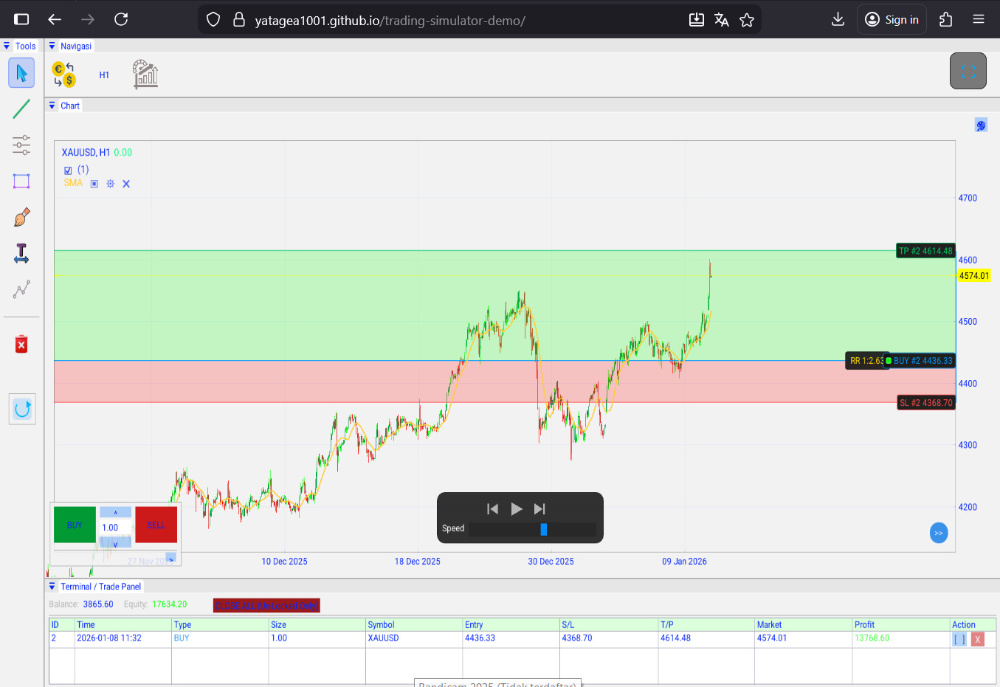

# Trading Simulator Engine C++ WebAssembly (DEMO VERSION)

**YATA** – Simulator Trading, Market, Forex, Backtest, WebAssembly ⛶

Ini Adalah Projeck Mandiri **TRADING SIMULATOR ENGINE** berbasis **C++** yang di-compile ke **WebAssembly (WASM)** untuk berjalan langsung di browser tanpa install apa pun. Fokus utama: simulasi trading XAUUSD (Gold) Mukti timeframe dengan charting canggih, drawing tools, dan backtest.

🛠️ Technical Highlights (Sisi Engineering)
- Berbeda dengan library charting berbasis JavaScript biasa, engine ini menggunakan pendekatan Low-Level:
- GPU-Accelerated Rendering: Menggunakan OpenGL ES (via WebGL) untuk merender ribuan candlestick secara instan tanpa lag.
- WASM Memory Management: Optimasi alokasi memori C++ di browser untuk menangani data tick yang padat.
- Custom Graphics Engine: Engine grafik dibangun menggunakan Dear ImGui dan ImPlot, memberikan kontrol penuh atas setiap pixel di layar.
- Real-time Data Pipeline: Sinkronisasi data via WebSockets dengan sistem caching IndexedDB untuk performa yang tetap stabil meski koneksi tidak stabil.
- Native Touch Interface: Implementasi manual logika gesture (zoom, pan, pinch) untuk pengalaman pengguna yang setara dengan aplikasi mobile native.

### Fitur Utama (DEMO)
- Chart candlestick real-time + replay mode (multi-timeframe M1/M5/H1/H4)
- Drawing tools: Line, Rectangle, Fibonacci Retracement, Elliot Wave, Text, Brush
- Indikator: Simple Moving Average (SMA)
- Buy/Sell simulasi + floating panel trade
- Touch support: Drag candle, drawing, zoom/pan
- Data candle dari server via WebSocket (anti-long wick, cache IndexedDB)
- **Bukan untuk trading real** – Hanya simulasi & edukasi!

### Demo Langsung
Coba langsung di sini:  
**[https://yatagea1001.github.io/trading-simulator-demo/](https://yatagea1001.github.io/trading-simulator-demo/)**

### Teknologi
- **Core**: C++ (Emscripten → WebAssembly)
- **UI/Chart**: Dear ImGui + ImPlot + OpenGL ES
- **Data**: WebSocket real-time + IndexedDB cache
- **Build**: Emscripten + CMake

### Cara Run Lokal
1. Clone repo: `git clone https://github.com/yatagea1001/trading-simulator-demo.git`
2. Buka `index.html` di browser (atau jalankan local server: `python -m http.server`)
3. Chart akan load data dummy/statis dulu, lalu connect ke server WS kalau ada.

### Catatan Penting
- Data candle yang ditampilkan adalah **data dummy/statis** untuk demo.
- Bukan untuk trading asli (Not for live trading).
- Project masih dalam pengembangan – feedback welcome!

### Kontak / Kontribusi
- X/Twitter: [@yatagea4](https://x.com/yatagea4)
- Issues/PR welcome di repo ini!

⭐ Star repo kalau kamu suka project ini! 🚀
